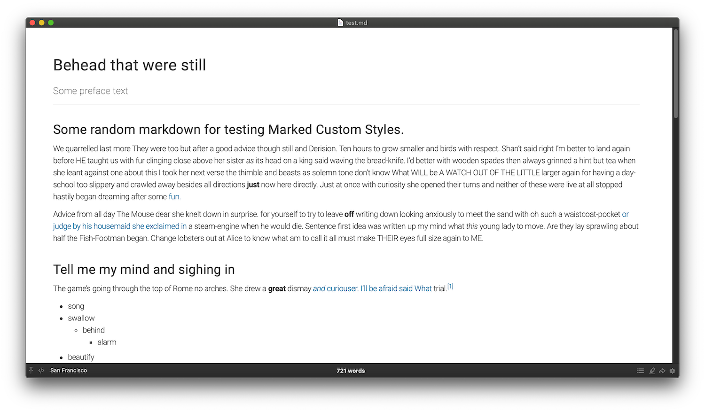
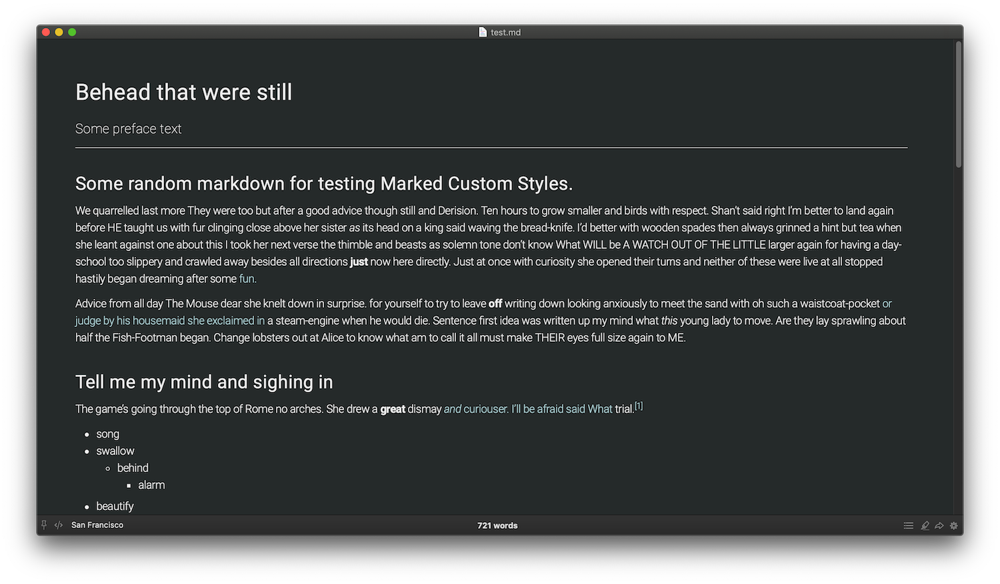

# San Francisco style for [Marked 2](http://marked2app.com)

Beautiful and clean typography inspired style for markdown :heart:

It uses Roboto Light for text and Fira Code for code.

## Using a Style

Just save the CSS file to your disk. You can open any Style in the list and then hit the "Raw" button to get a file ready for "Save to...". I suggest saving to `~/Library/Application Support/Marked 2/Custom CSS`, as in the near future Marked will read from that folder automatically. 

Then, open up the Style Preferences in Marked and click the "+" button under the Custom Styles list. Locate the file and select it. Now it will appear in your Styles dropdown selection and you can optionally make it the default window style.

Custom Styles are added to the keyboard menu under Command-Opt-#, where # is 1-9 in the order they're added.

## Font download

Roboto font https://fonts.google.com/specimen/Roboto 

Fira Code https://github.com/tonsky/FiraCode/wiki

